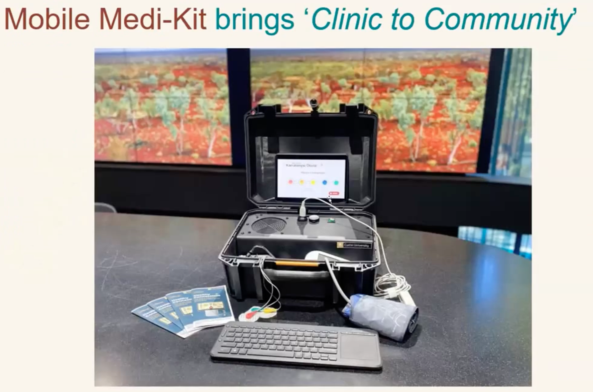
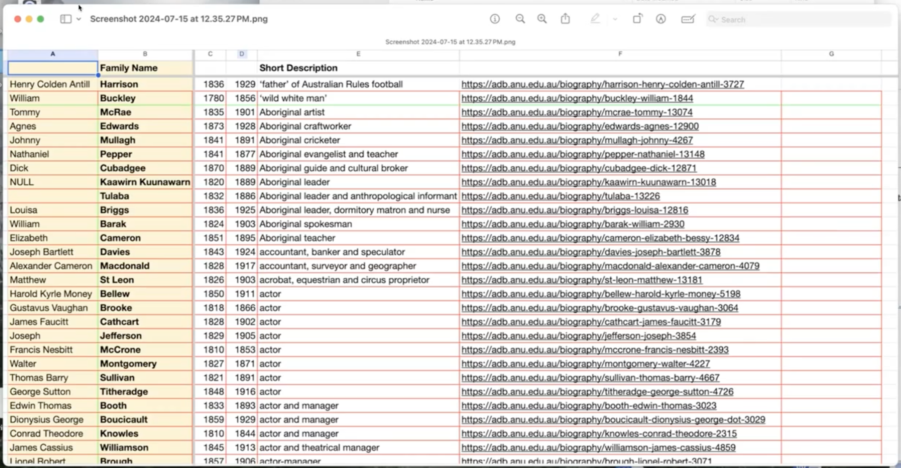
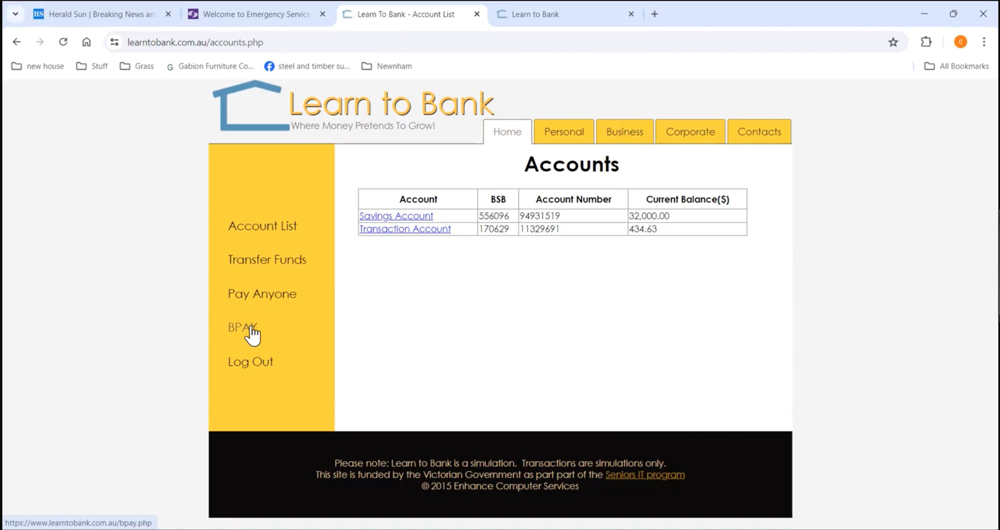
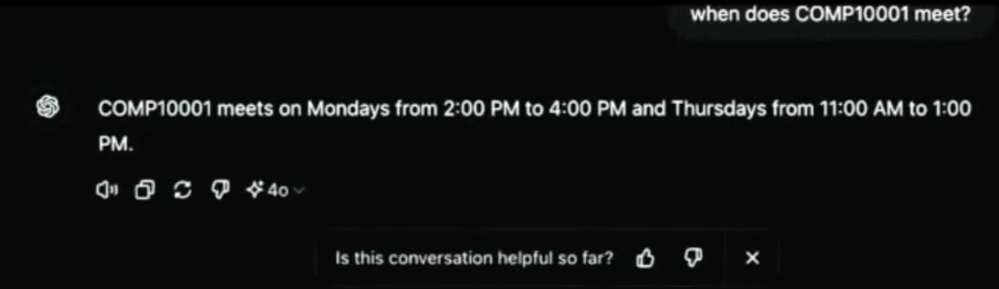
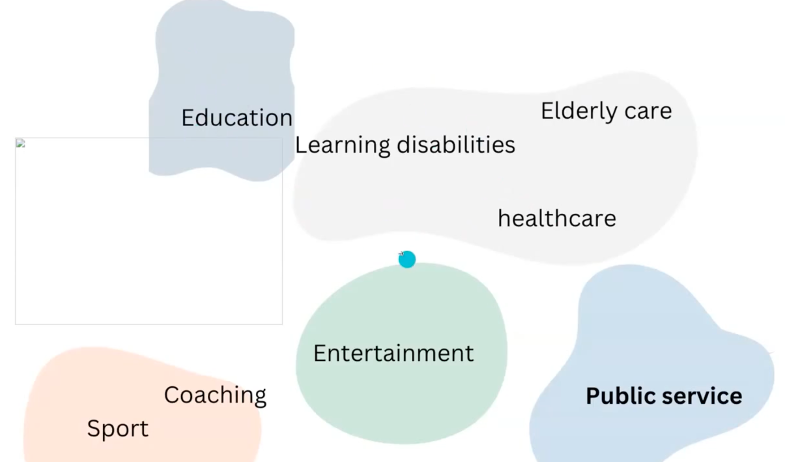
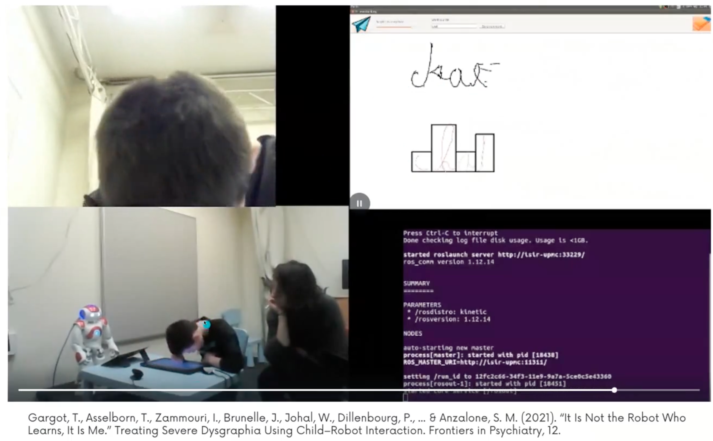
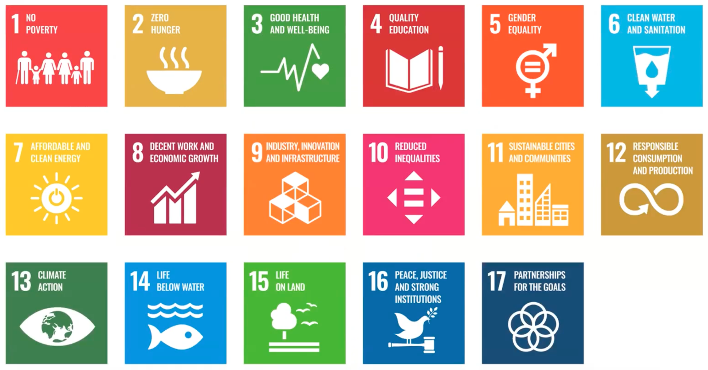
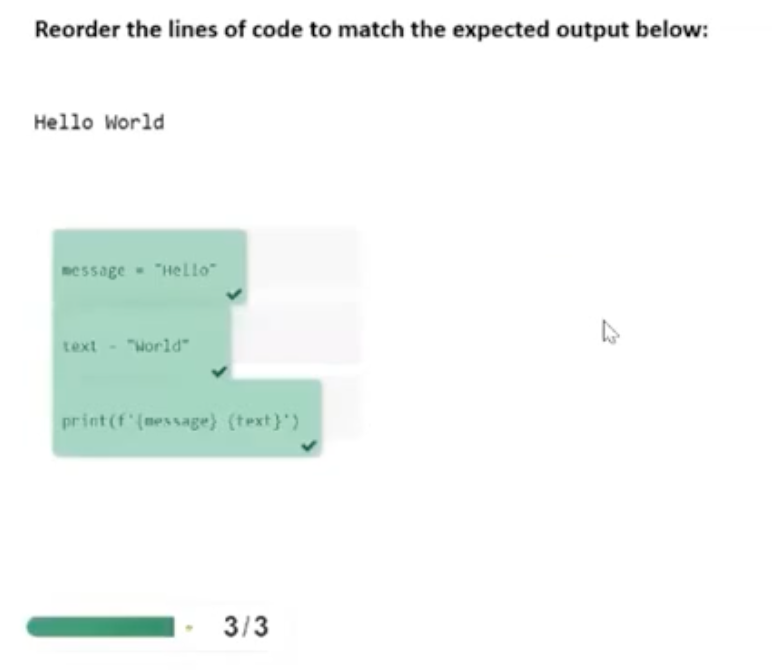

# IT Project Choices

## Introduction

在去年的ITP课程中, 学生对于external client (真实的外部客户) 有着更好的反馈, 因此在这学期我们将获得更多的外部客户选择. 外部客户更加灵活, 给团队更多的发挥空间, 更贴近现实的project.

> [!caution] 
> 但选择这些外部客户会面临更多的风险.
>
> * 一些外部客户会提供更难的project内容, 变得非常challenging
> * 一些外部客户会有更少的沟通时间, 因为他们会有其他的安排, 这会使得沟通困难.

## Project: Algorithms in Action

**| Tuesday 4:15PM | 15   |**

> [!Warning]
>
> 目前小组正在此选项中, **是否考虑变动**

这个project目标是将算法可视化. 我们现在已经有15-16种算法完成了javascript的开发. 似乎会为我们提供1-2个新算法作为最终的团队任务. 并在最后通过javascript的掌握, 进行全局的(整个网页的)颜色调整, 以满足有色盲的人们的学习需要.

* 这个项目针对乐于教学算法的学生是一次非常有趣的选择.
* https://dev-aia.vercel.app/

> [!important] 
>
> 需要对JavaScrip有熟练的掌握

> [!note]
>
> * 能否看到先前的前端后端源代码?
> * 是否有脚手架资源?
> * 多少算法需要团队实现?

## Project Sets: No Moss

**Tuesday 12PM**

一个软件开发团队, 提供了三个项目可供选择.

###  Project: Pace It ***

这是一个发布于Android and iPhone上的移动端App, 帮助慢性疲劳综合症患者(CFS). 他们可以使用这个app来寻找到有助于积极面对病情的模式和活动.

目前拥有一个app正上架于Android和iPhone AppStore. 但非常老旧, 持续维护了6年.

<u>我们的目标是rebuild这一个app.</u>

> [!Important]
>
> 前端:
>
> * native iOS and Android; or
> * Flutter (multiplatform)
> * 已经有一些app的设计元素可供使用 (即使团队中没有designer可直接使用这些)
>
> 后端:
>
> * Node.js / Typescript
> * AWS SAM + Lambda + API Gateway + DynamoDB
> * Auth0

> [!note]
>
> * 有没有源代码?
> * 是否会有新需求加入?

### Project: Momentum Master

这个project目标是通过数字平台，使个人能够定期进行有指导的自我反思，并以自我为导向进行学习和发展，从而掌握自己的职业发展方向。

> [!Important]
>
> * Responsive Web-app (desktop/mobile)
> * Nuxt app (Vue.js / Typescript)
> * Hosted on Vercel
> * Auth0 for authentication

> [!note]
>
> * 如何测试
> * 使用场景明确一些

### Project: Advice Process Bot

该任务目标是通过集成到Slack / Microsoft Teams的数字工具支持组织中的de-centralised decision making (去中心化决策过程).

> Advice Process Bot通过自动化和系统化的方式，简化了征求建议的过程. **避免遗漏通知相关方**, **节省的时间和精力**
>
> "任何人都可以做出任何决定，只要他们愿意对结果负责，并且首先听取了任何将受到影响的人或拥有相关专业知识的人的意见"。—— Dennis Bakke
>
> https://www.corporate-rebels.com/Blog/advice-process

> [!important]
>
> - Nuxt (Vue.js / Typescript)
>
> - Hosted on Vercel and
>
> - Slack Bot
>
> Bonus：
>
> - Discord & MS Teams Bot

### Project: Thanksharing

> Thanksharing 是一个团队活动，人们可以向另一个队友分享感谢的话语，关键规则是感谢的接收者是匿名的（即，不说被感谢的人的名字）这是no moss的公司文化.

该任务希望Thanksharing这个活动能够在Digital Work的环境中(Slack)仍然能够周期性的 (once a week) 起到相同的鼓舞人心的作用.

> [!important]
>
> Responsive Web-app (mobile / desktop)：
>
> * Nuxt app (Vue.js / Typescript)
> * Hosted on Vercel
> * AuthO forauthentication

## Project: Curtin Health

**Wednesday 4:15PM**

### Use Cases

心血管疾病以及肾脏健康与糖尿病, 由于在当地没有合适数量的医疗资源(e.g., 长期驻扎的医生等), 因此没有尽早接受检查, 直到可预防的病情变得恶化后.

### Medi-Kit Intro

1. 一个平板 (任何种类/系统)
2. 一个processer
3. 一个battery
4. 一个router
5. ECG pads (心电图贴片)

### Medi-Kit UI

- Based on 715 health check

- Screening tests e.g. ECG (心电图)
- Chatbot
  - 一个inbuilt AI用于了解ECG图的波形是做什么的, 即使你并不了解它.
  - 给予一些关于是否确诊疾病的风险评估

### Function and Reguriements

这个项目我们的要求是:

1. 数字化 (Digitisation)
   - 使得工作流数字化 —— 让clinical process变得更加迅速与高效. 让医师花更多时间与病人交谈, 而不是忙于在电脑中打字
2. 模块化 (Modular)
   - 数字化设备模块化. 可以随时添加一些诸如检测设备.
3. AI运用
   - 虚拟健康助手
   - 条件分类器 (做出诊断)
   - 使用大语言模型 (LLM) 解释和结果分析
   - 使用大语言模型 (LLM) 用来跟进信息
4. 网络安全
   - 以及风险评估
5. 连接性
   - 安全的使用multi-path网络进行连接
   - e.g., 使用卫星连接至网络 (Optus和Cisco等运营商)
6. 可持续供电

> [!note]
>
> 小组可以做点什么?
>
> 如何将这些巨大的工作分配到小组?

## Project: Medical Pantry

### UseCases

> [!note]
>
> Medical Pantry: 医疗器械存储

> Medical Pantry是一个注册慈善机构, 位于Laverton north, Victoria. 
>
> 目前healthcare正产生很多的浪费问题
>
> * 维多利亚州的公共卫生服务每年产生3.5万吨废物，其中处理这些废物耗费公共卫生服务近1700万美元
> * 医疗卫生对澳大利亚总温室气体排放的贡献占7%，其中70%与供应链有关。
> * 在食物废物之后，医疗卫生是填埋场的第二大贡献者。
> * 这个问题的恶化是由于向使用一次性产品的转变，这使得保持治疗环境清洁变得更加简单。
>   * 我们正扔掉的一些“医疗垃圾”中, 有30%还是全新的, 可以进行reuse.
>     * 注射器、针头、麻醉剂、机器、透析机。
>     * 仍然可以用于兽医, 训练医师等

目前最大的问题是Sorting, 30000个items需要被被200多个志愿者手动分拣至1000个类别中. 而志愿者很多是大学生, 他们并没有接受过医疗训练, 他们不知道这些products是什么. 因此有着非常缓慢的学习曲线 (learning curve), 与分拣error.

### Requirement of Solution

1. 网站管理后台
2. 利用智能手机进行**计算机视觉**（iOS/Android）
   a. 识别物品
3. 向用户展示信息
   a. 产品信息
   b. 分类箱——“鸽子洞” 的位置指示
   <u>c. 额外信息 - 绕过分类并存放的过程, 直接将该设备发送给需要的人. (符合“订单需求”直接提示发送?)</u>

#### Further Requirements

可能会共享**额外信息(上方)**给到donors.

> 让捐献者也access这个app, 从而让他们了解FAQs
>
> FAQ: 这些器械做什么用? 会给谁? 你们会据为己有吗? 二次售卖吗? 

从而让捐献者有更清楚的认知, 是否应该捐献出去.

> [!note]
>
> * 计算机视觉模型训练时, 数据集如何来?

## Project: C-Lara extensions

> [!Caution]
>
> 未讲解

该项目是进行Language Learning, 是去年的一个成功课题. 通过与ChatGPT的交互.

## Project: History biographer's aide

### Use Cases

> [!note]
>
> 客户为——澳大利亚辞典传记维多利亚州工作组主席。

这个项目的工作是: 修订19世纪的词典传记条目.

### Requirements

* 在图片最右侧的column中, 署上进行此条目整理的工作者(责任人)的名
* 通过“Short Description”列的职业描述选择我们感兴趣的人

分类:

* 将这些entries分成4个类别
  * A - 无需修改
  * B - 需要细微修改
  * C - 需要重大修订
  * D - 需要完全重写 **(有很大一部分)**

**需要将spreadsheets成为一个Database/前端App**

1. 所有工作者都能够访问
2. 能看到各自正在进行的工作
3. 可以进行搜索

> [!important]
>
> 客户是职业做历史修订的, 完全不了解电脑系统. 可能需要更加明确任务目标, 可能会有更多的需求待发掘, 以及一些适当的创新?
>
> * 一组人做前端
> * 一组人做后端——“report生成”?????

> [!note]
>
> * 需要做什么, 似乎不需要很强大的数据库来进行处理, 仅仅需要entry分类.

## Project: Langwarrin Community Centre Website

### Requirements

客户需要一个新的社区网页, 完全不了解IT内容.

* 更快更简单地修改网页内容
* 让网页使用者
  * 更好的在线观看courses内容
  * 在线完成paperworks
  * (可能的) 允许用户线上支付
* 有两种Courses内容, 取决于募资情况. 因此需要多个不同的enrolment表单/前端
* 展现出社区中有什么, 并简单地实时更新
  * 房间出租等

> [!TIP]
>
> - **想要了解目前的老网页的样式.** 
> - 无法全部get online是什么意思? 
> - 目前工作者是如何更新内容的?

## Project: Learn to bank (Online Banking Simulator)

### Use Cases

客户是社区tutor, 在社区中帮助老人进行现代社会化教学. 想要帮助老人克服对于Online Banking的恐惧. 想要对目前的Banking Simulator进行升级改造. 

### Requirements

* 保持目前的功能正常
* 提升UI界面, 允许手机端和电脑端都能正常访问.
* 添加新功能
  * 加入Recurring Payments / Schedule Payments (调整时间功能)

## Project: Software tool for Psychology Assignments

### Use Case

> 客户研究方向 —— 成人发展心理学 - “Developmental Psychology in adulthood”. 需要学生去采访一个adult, 并根据成人的言语及主题进行一些有价值的分析.

教育工作者 (老师) 可以编写一个包含信息的场景，我们可以将其放入类似ChatGPT中 (能够根据信息模拟出一个virtual adult的行为). 给学生一个模拟的采访对象进行练习, 回答学生的问题, 并让学生对ChatGPT反馈的问题答案进行专题分析。

### Requirements

1. 需要一个登录界面让学生/老师进入
2. 不同类型的工作者有不同的interface进行管理
   - 老师进入后可以设置虚拟聊天场景和人物细节的设定修正.
   - 学生在进入后不能看到老师的设定, 仅有简单的interface能够与获得Virtual Adult进行模拟对话 —— 问答
3. 最好是口头回答, 允许与带声音的ChatGPT进行交互.

> [!important]
>
> * **ChatGPT会有一个prompt限制** (一次性不能太多输入???), 寻找一个方式如何绕开它, 或是转用一些其他的模型?
> * 我们希望根据学生的询问生成一份Transcript (成绩单)，也许是一份 PDF 或 word 文档，他们不能修改，但可以上传。
>   * 允许为educators提供一份更精简的, 按照scene情况分析过的一份transcript
> * 为学生设定有限的questions数量.

> [!note]
>
> 深度绑定GPT.
>
> 成绩单是否有格式需求.

## Project: Gardening Advice

### Use Case

一个园艺建议app, 使用起来非常简单, 面向对象是那些可能不怎么接触手机的人(e.g., 老人). 主要任务是, **告诉使用者, 现今时刻在花园中可以种植什么**. 

* 使用对象可以选择种植的种类, 例如 蔬菜, 果树, 或其他的植物 —— 玫瑰、Naples或blossom trees。
* 允许对象添加种植的地点, 例如 Melbourne.
* 允许添加花园的情况, 例如 Full Sun, Heart Shade, 或是 Fully Shaded

App可以反馈出可以种植什么, 以及如何照顾好种植物.

### Requirements

* UI非常简单易用
* APP添加Reminders, 例如浇水, 施肥和修剪植物等. (可选的)
* 使得APP变得能够满足用户的所有gardening需求, 使得gardening变得容易, 有乐趣的面对任何人.
* 为这个APP起一个名字

> [!note]
>
> 植物种类信息如何获得?
>
> 推荐算法?

## Project: Updating the handbook

### Use Case

从头开始重新设计和重建每个人都在使用的最突出的应用程序之一 —— The Handbook。

目前的Handbook非常难用, 难以定位信息, digest ways具有挑战性，性能也不是特别好。

### Requirements

在这次任务中, 需要包括多个内容:

* 了解用户需求
* 构建**自动爬虫工具**，以获取现有学科数据集
* 并为这些数据创建一个新的前端搜索UI

可选的:

* 将任务拓展到chatbot上. 让这个chatbot允许搜索这些学科数据, 并**提供可靠的回答**.
* 与学校timetable进行接口对接，以提供整个学期的综合信息或课程规划。

## Project: Robot Projects

客户: 上学期AI lecturer

### Use Case

> social companion是一种能够与人进行社交互动的机器人。在不同的领域中
>
> 
>
> 如下图社交机器人在治疗过程中与一名书写困难儿童和治疗师。
>
> 
>
> 在这个特殊场景中，我们使用一个平板电脑。机器人会书写或尝试书写，然后孩子必须纠正机器人的错误。重复几次并向机器人演示几次, 孩子们的书写水平就会提高。

在明年, 我们会有一个human robot interaction conference来到墨尔本举办. 在会议中的重要目标是, 评估机器人如何帮助发展一个可持续发展的世界。

因此我们需要制作一个app来解决这个评估问题. 

根据UN提出的17个sustainability goal来进行评估?

### Requirements

选取以上的任意一个sustainability goal

* 试图利用机器人的能力
* 编写一个平板的UI界面
* 让使用者用平板与robot进行交互, 并让使用者学习到你选择的sustainability goal?

> [!important]
>
> 需要编写robot的程序+平板 UI界面

## Project: Web Interface for Parsons Problems

> Parsons Problems (帕森斯问题) 是由随机代码块组成, 要求学习者重新排序, 以匹配预期输出或实现目标. (Parsons and Haden, 2006)
>
> - 针对编程初学者的脚手架练习
> - 通常通过拖放动作解决
> - 通常为基本编程结构创建问题

### Use Case

1. 一个网络应用程序，允许用户<u>根据所选主题和背景</u>自定义生成**数据分析 - "Data Analytics"**的帕森斯问题。
   - 例如，以考拉为背景的线性回归帕森斯问题。
2. 问题生成后，用户可以通过相同的网络应用程序解决问题或生成新问题。

### Requirements

- 易于使用的UI界面
- 使用 ChatGPT 生成问题
- 根据用户选择的主题和背景定制问题
- 用户每次提交都会收到反馈
  - 收到的反馈类似于在任何集成开发环境中运行代码时给出的结果
- 存储用户与网络应用程序和问题互动的基本分析信息

> [!note]
>
> * ChatGPT应该如何接入, 如何生成问题
>   * 怎么确保chatgpt生成一个, 正确能够运行的python程序
>     * 生成编程主题
>     * 生成背景关系
> * 拖拽模块吸附如何制作.

## Project: Global sustainability goals

内容：

- 清晰准确地介绍 17 项可持续发展目标中的每一项。
- 使用各种媒体（文字、图片、视频）解释目标。
- 与每个目标相关的实际应用和成功案例。
- 供进一步阅读和参与的资源和链接。

设计:

- 用户界面友好，导航直观。
- 生动有趣，催人奋进。
- 响应式设计，确保兼容各种设备（台式机、平板电脑、智能手机）。
- 使用一致的颜色、字体和图形，具有视觉吸引力。
- 无障碍功能（例如，图片的alt文本、可读字体、对比度）。

功能性:

- 注册和登录
- 为完成有关可持续发展目标的某些部分或测验纳入徽章或奖励。
- 测验、投票等互动元素。
- 搜索功能，帮助用户快速查找特定信息。
- 管理员控制面板，用于定义和更改活动

> [!important]
>
> - 实施基本的搜索引擎优化实践，提高搜索引擎的可见度。
> - 安全、可扩展的架构，以处理潜在的流量。

## Project: Timetabling for VIT

> VIT -> Victoria Institute of Technology. 是一个私立高校. 在校内运行IT课程

### Use Case

在安排课程、安排相关讲师和寻找教室方面存在挑战. 这是一个经典的timetable问题. 了解class之间的constraints是这个program的目标. (CSV问题)

### Requirements

这会是一个合适的作为project的问题规模. 因此VIT的学生想要了解我们是如何解决这个问题的.

> [!important]
>
> 我们需要了解这个NP-Complete问题的scale (规模). 如果这个问题规模太大, 这个program将会非常困难.
>
> 而当规模小一些时, 我们可以借助简单的exhaustive search就能完成.

 

# 难易度Order

1. Linda Stern: Algorithms in Action
2. Paul Tran: No Moss **(手机APP)**
3. Carolyn Rasmussen: History biographer’s aide
4. Sha’anan Cohney: Updating the handbook
5. Cheryl Ewin: Learn to bank (online banking simulator)
6. Leona Spencer-Jones: Langwarrin Community Centre Website
7. Melissa Hofsteter: Gardening advice
8. Martin Nguyen: Medical pantry
9. Susannah Soon: Curtin Health project
10. Sebastian Ng: Timetabling for VIT
11. Carrie Ewin: Psychology Assignment Software **ChatGPT模拟adult**
12. Wafa Johal: Robot projects
13. Manny Rayner: C-Lara extensions
14. Ati Kia: Global sustainability goals **——** 
